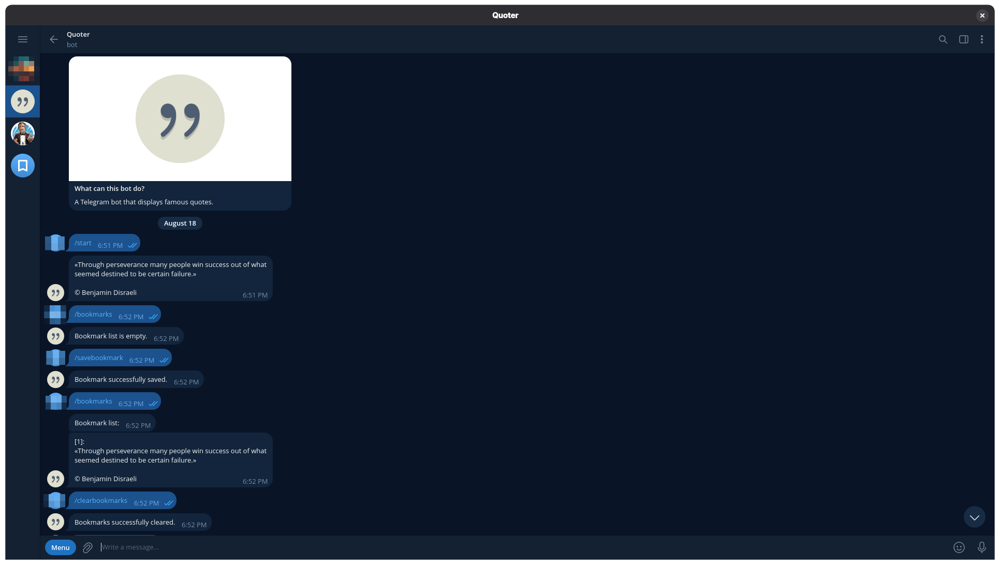
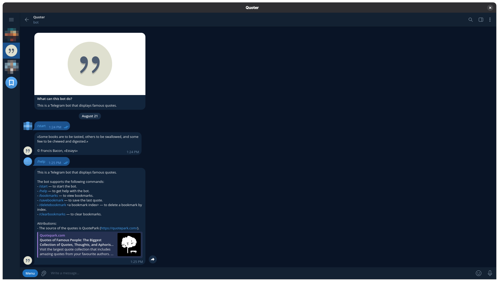
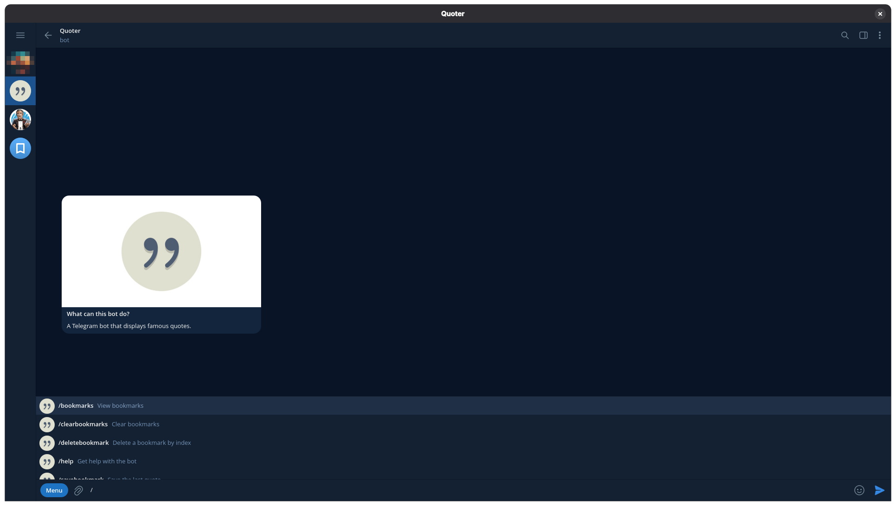

# Quoter Bot

<p align="center">
    
</p>

<h3 align="center">A Telegram bot that displays famous quotes</h3>

## Tech Stack

<p align="center">
    
    
    
    
    
    
</p>

## Overview

This is a Telegram bot that displays famous quotes.

## Screenshots

<p align="center">
    
    
    
</p>

## Requirements

1. `Node.js` runtime environment for running the bot.
2. `pnpm` package manager for installing dependencies.

## Prerequisites

Before setting up the bot, make sure you have:

1. a
   <a href="https://telegram.org/" referrerpolicy="no-referrer" rel="noopener noreferrer" target="_blank">Telegram
   account</a>;
2. a
   <a href="https://core.telegram.org/bots" referrerpolicy="no-referrer" rel="noopener noreferrer" target="_blank">Telegram
   bot</a>;
3. a token from BotFather to authenticate your bot;
4. a Redis database on
   <a href="https://upstash.com/" referrerpolicy="no-referrer" rel="noopener noreferrer" target="_blank">Upstash</a>.

## Installation

Follow these steps to set up the bot:

1. Clone the repository:

    ```bash
    git clone https://github.com/madliani/quoter-bot.git
    cd quoter-bot
    ```

2. Install dependencies:

    ```bash
    pnpm install
    ```

3. Set up the frequency of messages sent by the bot, your bot token, your
   database token, and your database URL:

    Create a `.env` file in the root directory, and add the following lines:

    ```bash
    FREQUENCY=your-frequency # in minutes
    TELEGRAM_BOT_TOKEN=your-bot-token
    UPSTASH_REDIS_REST_TOKEN=your-db-token
    UPSTASH_REDIS_REST_URL=your-db-url
    ```

4. Run tests:

    ```bash
    pnpm test
    ```

5. Build the bot:

    ```bash
    pnpm build:release
    ```

6. Start the bot:

    ```bash
    pnpm start:release
    ```

## Usage

The bot supports the following commands:

- `/bookmarks`: to view bookmarks.
- `/clearbookmarks`: to clear bookmarks.
- `/deletebookmark <a bookmark index>`: to delete a bookmark by index.
- `/help`: to get help with the bot.
- `/savebookmark`: to save the last quote.
- `/start`: to start the bot.
- `/stop`: to stop the bot activity.

## Project Structure

- `assets/`: a directory containing the assets for the `README.md` file.
    - `assets/icons/`: a directory containing the icons for the `README.md`
      file.
        - `assets/icons/quote.png`: a quote icon and also the bot picture.
    - `assets/images/`: a directory containing the images for the `README.md`
      file.
        - `assets/icons/quoter-description.png`: a description picture for the
          bot.
- `bot/`: a directory containing the source files for the bot.
    - `bot/assets/`: a directory containing the assets for the bot.
        - `bot/assets/json/`: a directory containing the texts for the bot UI.
    - `bot/lib/`: a directory containing libraries for the bot.
    - `bot/bot.ts`: a file containing the bot.
- `lib/`: a directory containing the source files for libraries for the bot.
- `src/`: a directory containing the entry point of the `Node.js` program.
    - `src/types/`: a directory containing the type declarations for the entry
      point of the program.
    - `src/main.ts`: a file containing the entry point of the program.
- `types/`: a directory containing the type declarations for the configuration
  files.
- `.env`: an environment variables file.
- `.gitattributes`: a `Git` attributes file.
- `.gitignore`: a `Git` ignore file.
- `.prettierignore`: a `Prettier` ignore file.
- `AUTHORS.txt`: an `AUTHORS` file.
- `CHANGELOG.md`: a `CHANGELOG.md` file.
- `CONTRIBUTING.md`: a `CONTRIBUTING.md` file.
- `cspell.config.js`: a JavaScript-based `cSpell` configuration file.
- `eslint.config.js`: a JavaScript-based `ESLint` configuration file.
- `LICENSE.txt`: a license file.
- `package.json`: a `package.json` file.
- `pnpm-lock.yaml`: a `pnpm` lockfile.
- `pnpm-workspace.yaml`: a `pnpm` Workspace file.
- `prettier.config.js`: a JavaScript-based `Prettier` configuration file.
- `README.md`: a `README` file.
- `tsconfig.app.json`: a `TypeScript` configuration file for the bot.
- `tsconfig.json`: a base `TypeScript` configuration file.
- `tsconfig.json`: a main `TypeScript` configuration file.
- `tsconfig.test.json`: a `TypeScript` configuration file for the tests.
- `tsdown.config.js`: a JavaScript-based `tsdown` configuration file.
- `vitest.config.js`: a JavaScript-based `Vitest` configuration file.

## Branches

- `stable`: a stable branch for production builds.
- `unstable`: an unstable branch for development and testing.

## FAQs

<details>
<summary>Under what license is the source code distributed?</summary>

The source code is distributed under the [Unlicense](./LICENSE.txt) license.

</details>

<details>
<summary>How do I start contributing to the project?</summary>

To learn about contributing to the project, see
[CONTRIBUTING.md](./CONTRIBUTING.md).

</details>

<details>
<summary>Why are some development dependencies necessary?</summary>

These dependencies are necessary for other dependencies to work correctly.

| Dependency | Purpose                              |
| ---------- | ------------------------------------ |
| tslib      | Dependency for `typescript` package. |

</details>

## Attributions

- The **Quote icon** (`./assets/icons/quote.png`), created by Nick Roach and
  licensed under the
  <a href="https://www.gnu.org/licenses/gpl-3.0.html" referrerpolicy="no-referrer" rel="noopener noreferrer" target="_blank">GPLv3</a>
  license.
- The source of the quotes is
  <a href="https://quotepark.com/" referrerpolicy="no-referrer" rel="noopener noreferrer" target="_blank">Quotepark.com</a>.
